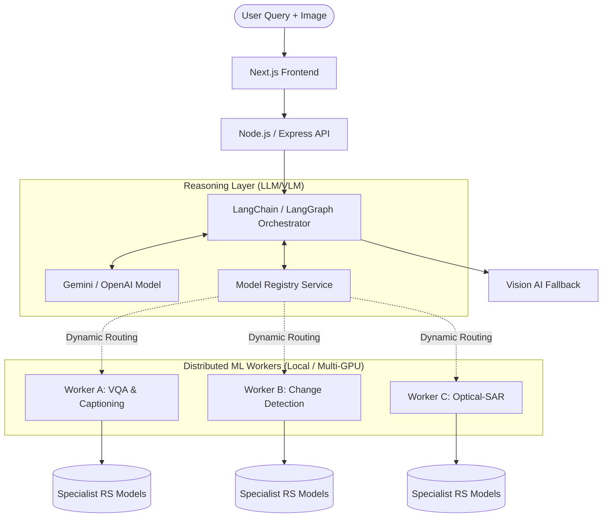

# SatQuery AI — AI/ML Workflow & Architecture

This document outlines the complete Artificial Intelligence and Machine Learning workflow implemented in the SatQuery AI platform. It describes how user queries and satellite imagery flow from the frontend through the orchestration layers and into specialized remote-sensing ML models.

---

## 1. High-Level Architecture

SatQuery AI uses a **hybrid AI orchestration model** that combines a central LangChain/LangGraph reasoning agent with distributed, specialized remote-sensing (RS) ML Workers.



---

## 2. The Request Lifecycle

### Step 1: Query Ingestion (Frontend → Node.js)
The user uploads one or more remote-sensing images (e.g., GeoTIFF, PNG, JPEG) along with a text query. The Next.js frontend securely uploads this payload to the Node.js backend.

### Step 2: Task Classification (LangChain Agent)
The Node.js backend uses a **ReAct Agent** (Reasoning and Acting) powered by a general LLM (like Gemini Pro or OpenAI). 
The Agent analyzes the user's text prompt and the nature of the uploaded images to determine the required task.

Supported Remote-Sensing Tasks:
1. **RS-VQA** (Visual Question Answering)
2. **Captioning** (Scene Description)
3. **Grounding** (Bounding boxes for requested features)
4. **Change Detection** (Bi-temporal image analysis)
5. **Change-VQA** (Question answering based on changes)
6. **Optical-SAR Fusion** (Cross-modal analysis)

### Step 3: Model Discovery & Routing (Model Registry)
Once the task is identified, the Agent queries the internal **Model Registry**.
- The Registry acts as a dynamic service mesh.
- It continuously polls `/ml/health` and `/ml/models` across configured ML Worker endpoints (e.g., `VQA_ML_URL`, `CHANGE_ML_URL`).
- It identifies if a specialist model is currently `READY` on any available ML Worker.

### Step 4: ML Worker Inference (Python FastAPI)
If a specialist model is available, an `MLClient` sends the payload (images and text) to the corresponding ML Worker.

The ML Worker:
1. **Validates & Preprocesses**: Uses `rasterio` and `numpy` to parse GeoTIFF metadata, check CRSs, and align dimensions.
2. **Infers**: The request is passed into a uniform `RemoteSensingModel` adapter, which passes the tensor into the actual PyTorch/Transformers pretrained model.
3. **Postprocesses**: Outputs are mapped into a standardized JSON response schema.

### Step 5: Graceful Fallback (Vision AI)
If the required ML Worker is `OFFLINE`, `NOT_CONFIGURED`, or returns a `GPU_OUT_OF_MEMORY` error, the `MLClient` catches this failure.
The Agent gracefully falls back to the **General Vision AI** (e.g., Gemini 1.5 Pro Vision), performing a generalized analysis of the image rather than failing entirely.

### Step 6: Response Synthesis
The LangChain agent ingests the structured output from either the Specialist Model or the Fallback VLM, synthesizes a human-readable response, and streams it back to the Frontend.

---

## 3. Distributed ML Worker Concept

SatQuery AI explicitly supports running extremely large Remote-Sensing models locally by distributing them across multiple GPUs or laptops on a local network.

* **No Virtual GPU required:** You do not need to merge GPU memory.
* **Task-based splitting:** You can assign the Heavy Change Detection model to a desktop with an RTX 4090 (`http://192.168.1.10:8001`), and a lightweight VQA model to a laptop with an RTX 3060 (`http://192.168.1.11:8002`).
* **Environment Variables:**
  ```env
  # In backend/.env
  VQA_ML_URL=http://192.168.1.11:8002
  CHANGE_ML_URL=http://192.168.1.10:8001
  ```

---

## 4. ML Service Internal State Machine

Models loaded into the ML Workers are strictly tracked using a lifecycle state machine to prevent UI crashes:

* `NOT_CONFIGURED` - No weights or HF model ID provided in config.
* `OFFLINE` - The service cannot be reached.
* `LOADING` - Model is currently being loaded into VRAM.
* `READY` - Model is loaded and waiting for inference.
* `BUSY` - Model is currently processing a tensor.
* `ERROR` - A critical failure occurred (e.g., CUDA Out of Memory).

---

## 5. Adding New Pretrained Models

The system is designed with an **Adapter Pattern**, ensuring that adding new models requires zero changes to the LangChain orchestration logic.

To add a new model:
1. Download weights to `ml-service/models/` or configure a HuggingFace Hub ID.
2. Open the corresponding adapter file (e.g., `app/models/vqa_model.py`).
3. Implement `load()` (moving weights to `self.device`).
4. Implement `predict()` (processing inputs and returning `ModelOutput`).
5. The Node.js Registry will automatically detect the new capability on the next health check loop.
