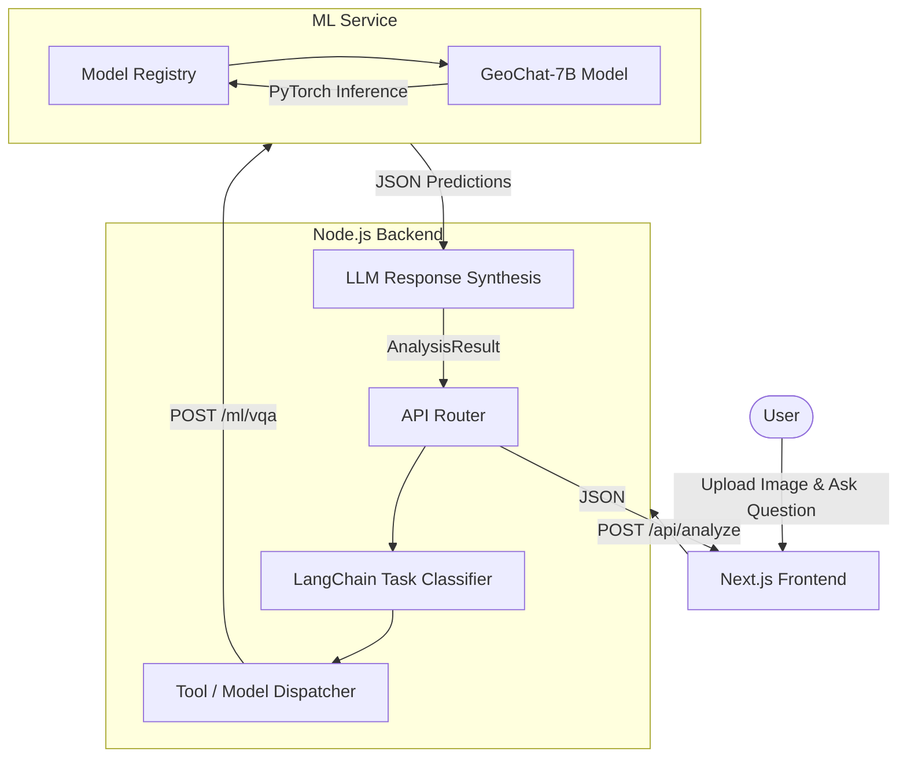

# SatQuery AI — Product Requirements & Technical Documentation

This document serves as the single source of truth for the SatQuery AI project. It covers both the product vision and the exact technical implementation, documenting architecture, API routes, model integrations, and operational workflows based directly on the actual codebase.

---

## 1. Project Overview

**Project Name:** SatQuery AI
**Purpose:** An extensible, multi-modal Vision-Language Assistant tailored for satellite and aerial imagery.
**Core Problem:** Remote-sensing analysis traditionally requires complex GIS tools and specialized knowledge. SatQuery democratizes this by allowing users to ask natural language questions about satellite imagery.
**Target Users:** Analysts, researchers, and non-technical decision-makers who need to extract insights from satellite data quickly.
**Main Workflow:**
1. User uploads 1 or 2 satellite images (GeoTIFF, PNG, JPEG).
2. User asks a natural language question (e.g., "Where are the ships?").
3. System classifies the task, runs it through an AI model (like GeoChat), and returns a human-readable answer along with bounding-box evidence.
4. User can download the analysis as a report.

**High-Level Architecture:**
SatQuery uses a decoupled **3-tier architecture**:
1. **Frontend:** Next.js web application for user interaction.
2. **Backend:** Node.js API acting as an Agentic Orchestrator (LangChain).
3. **ML Service:** Python FastAPI server hosting local PyTorch inference models.

---

## 2. Complete Technology Stack

### Frontend
* **Framework:** Next.js 14 (App Router)
* **Language:** TypeScript
* **UI/Styling:** Tailwind CSS, Lucide React Icons
* **Data Fetching:** Standard HTTP Fetch API
* **Components:** React Dropzone (for uploads)

### Backend
* **Framework/API:** Node.js with Express.js
* **Language:** TypeScript
* **Middleware:** CORS, Express JSON parser, custom Error Middleware
* **AI Orchestration:** LangChain (used for query classification and response synthesis via AIProviderFactory)
* **Storage/Database:** MongoDB (via Mongoose)
* **File Handling:** Local static serving via Express (`/uploads` directory)

### AI / ML (ML Service)
* **Framework:** Python 3.10+, FastAPI, Uvicorn
* **Core ML:** PyTorch (CUDA enabled)
* **Libraries:** HuggingFace Transformers, Accelerate, BitsAndBytes (for 4-bit/8-bit quantization)
* **Data Processing:** NumPy, Pillow (PIL)

### Infrastructure
* **Environment:** Distributed execution capable (Frontend/Backend can run on one machine, ML Service on a GPU machine).
* **Communication:** REST HTTP over local network (LAN)
* **Containerization:** Docker (planned/available via `docker-compose.yml`)

---

## 3. Current AI Model Architecture

The ML service is designed around a unified `RemoteSensingModel` abstraction, which allows models to be dynamically registered and loaded.

### Currently Integrated
* **GeoChat (VQA Model):** Fully integrated for Visual Question Answering, Region Grounding, and Scene Captioning.

### Planned / Model TBD
* **Change Detection Model:** For bi-temporal pixel-wise change detection.
* **Optical-SAR Fusion Model:** For cross-modal synthesis.

> **Note:** The backend router supports routing to these future models, but their specific PyTorch implementations are currently placeholders.

---

## 4. GeoChat Integration

**What it is:** GeoChat is a 7B parameter multi-modal Vision-Language Model specifically fine-tuned for remote sensing.
**Role:** It acts as the primary visual reasoning engine for the system.
**Input/Output:** Accepts an RGB image tensor and a text prompt. Outputs a streaming text response (which may include bounding box coordinates like `[x1, y1, x2, y2]`).

**Technical Implementation:**
* **Adapter:** Implemented in `ml-service/app/models/vqa_model.py`.
* **Loading:** Uses `bitsandbytes` to load in 4-bit precision to fit within 8GB VRAM (NVIDIA RTX 5050 target).
* **Conversation State:** Uses `llava_v1` conversation templates.
* **Error Handling:** The adapter traps `torch.cuda.OutOfMemoryError`, forcefully empties the CUDA cache, and returns a graceful `GPU_OUT_OF_MEMORY` status back to the Node.js backend.
* **Environment:** Requires the custom `GeoChat` repository to be injected into the `sys.path`.

---

## 5. Query Understanding and Query Routing

The system interprets user intent using an Agentic Workflow in the Node.js backend (`backend/src/agents/satquery.agent.ts`).

### The Pipeline:
```text
User Query + Image(s)
       ↓
Input Validation (Checks image counts based on InputType)
       ↓
Task Classification (AI-driven via LangChain OR Heuristic fallback)
       ↓
Model Router (Queries Registry for available READY models)
       ↓
ML Service API (Executes PyTorch inference)
       ↓
Response Synthesis (AI provider polishes the raw technical output)
       ↓
Final JSON Response to Frontend
```

### Classification Logic (`planner.ts`)
The orchestrator attempts to use an LLM (via `CLASSIFICATION_PROMPT`) to classify the task into exactly one category:
* `VQA`
* `CAPTION`
* `GROUNDING`
* `CHANGE_ANALYSIS`
* `CHANGE_VQA`
* `OPTICAL_SAR_ANALYSIS`

If the AI fails, a **Heuristic Fallback** uses simple keyword matching (e.g., if query contains "where" or "locate" ➔ `GROUNDING`).

---

## 6. Model Selection Strategy

The Model Registry in the Node.js backend maintains the health state of the Python ML Service.

| Model | Task | Input | Output | Status | Why Used |
| ----- | ---- | ----- | ------ | ------ | -------- |
| **GeoChat-7B** | VQA, CAPTION, GROUNDING | RGB Image + Text | Text + BBoxes | **Integrated** | State-of-the-art for remote sensing VQA, fits in 8GB VRAM with 4-bit quant. |
| *TBD* | CHANGE_ANALYSIS | 2x RGB Images | Heatmap/Text | *Planned* | Dedicated pixel-level temporal change model required. |
| *TBD* | OPTICAL_SAR | 1 Optical, 1 SAR | Text/Mask | *Planned* | Requires specialized multi-modal fusion architecture. |

---

## 7. Complete API Route Documentation

### Backend (Node.js) API
| Method | Route | Purpose | Input | Output | Service | Errors |
| ------ | ----- | ------- | ----- | ------ | ------- | ------ |
| `GET` | `/api/health` | Backend status check | None | `{ status: 'ok', ... }` | Backend | 500 |
| `POST` | `/api/upload` | Ingest user images | `multipart/form-data` | `{ images: [{...}] }` | Backend | 400 (Invalid file) |
| `POST` | `/api/analyze` | Main Agent pipeline | `{ query, inputType, images }` | `AnalysisResult` JSON | Backend → ML Service | 500 (OOM, ML down) |
| `GET` | `/api/analyze/:id` | Fetch past analysis | None | `AnalysisResult` JSON | Backend (DB) | 404 (Not found) |
| `GET` | `/api/analyze` | List analysis history | `?limit=N` | `{ analyses: [...] }` | Backend (DB) | 500 |
| `GET` | `/api/analyze/:id/report` | Download text report | None | `text/plain` file | Backend | 404 (Not found) |
| `GET` | `/api/models` | List available models | None | `{ registry: [...] }` | Backend → ML Service | 500 |

### ML Service (Python) API
| Method | Route | Purpose | Input | Output |
| ------ | ----- | ------- | ----- | ------ |
| `GET` | `/ml/health` | ML heartbeat/registry | None | Worker and Model status |
| `GET` | `/ml/models` | List loaded models | None | Model metadata |
| `POST` | `/ml/vqa` | GeoChat Inference | `{"query": "...", "images": [...]}` | `{"answer": "...", "evidence": []}` |
| `POST` | `/ml/caption` | Scene captioning | `{"query": "...", "images": [...]}` | `{"answer": "...", "evidence": []}` |
| `POST` | `/ml/grounding`| Bounding box generation | `{"query": "...", "images": [...]}` | `{"answer": "...", "evidence": []}` |
| `POST` | `/ml/change*` | Placeholder routes | `{"query": "...", "images": [...]}` | Placeholder JSON |

---

## 8. Request and Response Schemas

**Backend → Frontend Response (`AnalysisResult`):**
```json
{
  "id": "analysis_1690000000",
  "query": "Find the ships",
  "inputType": "SINGLE_IMAGE",
  "detectedTask": "GROUNDING",
  "answer": "There are 2 ships visible in the coastal region.",
  "confidence": 0.92,
  "modelUsed": "GeoChat",
  "modelSource": "SPECIALIST",
  "evidence": [],
  "executionTrace": [...],
  "toolsUsed": ["region_grounding"],
  "processingTime": 4500,
  "createdAt": "2026-09-01T12:00:00.000Z"
}
```

---

## 9. Codebase Architecture

```text
SatQuery/
├── frontend/             # Next.js UI
│   ├── src/
│   │   ├── app/          # App router pages (/, /dashboard, /history)
│   │   └── components/   # React components (Upload, Chat)
├── backend/              # Node.js Agent Orchestrator
│   ├── src/
│   │   ├── agents/       # LangChain task planners & state
│   │   ├── controllers/  # Express route handlers
│   │   ├── routes/       # Express route definitions
│   │   ├── services/     # Analysis and Report generation logic
│   │   └── server.ts     # Main Express entry point
├── ml-service/           # Python GPU Inference Server
│   ├── app/
│   │   ├── models/       # vqa_model.py (GeoChat adapter)
│   │   ├── routes/       # FastAPI endpoint handlers
│   │   └── main.py       # Main FastAPI entry point
│   ├── models/           # Checkpoint weights (downloaded)
│   └── GeoChat/          # Cloned GeoChat repository dependency
└── docker-compose.yml    # Full stack orchestrator
```

---

## 10. Multi-Laptop AI Architecture (LAN Deployment)

SatQuery is fully capable of running in a distributed local network environment without exposing data to the cloud.

### Implementation:
The Backend uses an environment variable `PYTHON_ML_URL` to route ML inference. 

**Laptop A (User UI & Backend)**
* IP: `192.168.1.10`
* Frontend: `http://localhost:3000`
* Backend: `http://localhost:8000`
* `.env`: `PYTHON_ML_URL=http://192.168.1.50:9000`

**Laptop B (GPU Machine)**
* IP: `192.168.1.50`
* ML Service binds to `0.0.0.0` (accessible over LAN).
* Command: `uvicorn app.main:app --host 0.0.0.0 --port 9000`

> **Networking Concept:** `localhost` routes back to the same machine. By binding the ML service to `0.0.0.0`, Laptop B opens port 9000 to Laptop A across the local network. 

---

## 11. PDF Report Generation

> **Planned / Future Implementation**

### Current Implementation
Currently, the codebase generates simple **text reports** (`.txt` files), implemented in `backend/src/services/report.service.ts` and served via `GET /api/analyze/:id/report`.

### Desired PDF Architecture (To Be Implemented)
A PDF generator will be added to the backend (likely using `pdfkit` or `puppeteer`).
* **Page 1:** The uploaded satellite image, user query, and execution metadata.
* **Page 2+:** The final synthesized text analysis, bounding box visual evidence, and model confidence scores.
* **Design:** Clean, white background, professional typography, highly legible.

---

## 12. Error Handling

**ML Service Errors:**
* **GPU Memory:** Caught globally in `vqa_model.py`. The model safely unloads tensors (`torch.cuda.empty_cache()`) and returns `{"status": "GPU_OUT_OF_MEMORY"}`.
* **Network Failures:** The background task downloader is wrapped in a resilient shell `while` loop that retries huggingface downloads on drop to prevent corrupted `.bin` cache files.

**Backend Errors:**
* The Agent Pipeline gracefully degrades. If the ML Service is unreachable, the orchestrator sets `modelSource: 'FALLBACK'` and attempts a pure text response, ensuring the Node.js server never crashes due to a GPU failure.

---

## 13. Environment Configuration

| Variable | Purpose | Example | Required | Used By |
| -------- | ------- | ------- | -------- | ------- |
| `PORT` | Backend port | `8000` | Yes | Backend |
| `AI_PROVIDER` | LLM used for planning | `openai` | Yes | Backend |
| `OPENAI_API_KEY` | Secret token | `<SECRET>` | Yes | Backend |
| `PYTHON_ML_URL` | Route to ML service | `http://localhost:9000` | Yes | Backend |
| `MONGODB_URI` | DB connection string | `mongodb://...` | Yes | Backend |
| `VQA_DTYPE` | GeoChat quantization | `4bit` | No | ML Service |
| `WORKER_ID` | ML Node Identifier | `gpu-node-1` | No | ML Service |

---

## 14. Architecture Diagram



---

## 15. Troubleshooting Guide

* **`GPU_OUT_OF_MEMORY` Error:** GeoChat requires ~6GB of VRAM in 4-bit mode. Close other GPU applications, ensure `VQA_DTYPE=4bit` is set in the ML Service `.env`, and restart the FastAPI server.
* **Backend cannot connect to ML service:** The backend `.env` contains `PYTHON_ML_URL`. If running across laptops, ensure this is set to the LAN IP (e.g., `http://192.168.X.X:9000`) and NOT `localhost`. Ensure the ML service was started with `--host 0.0.0.0`.
* **Corrupted HuggingFace Download:** If `hf download` hits a `416 Range Not Satisfiable` error, delete the `.cache/huggingface/download` directory in the `models/` folder and restart the download loop.

---

*This document was generated directly from source code inspection and represents the accurate, current state of the repository.*
