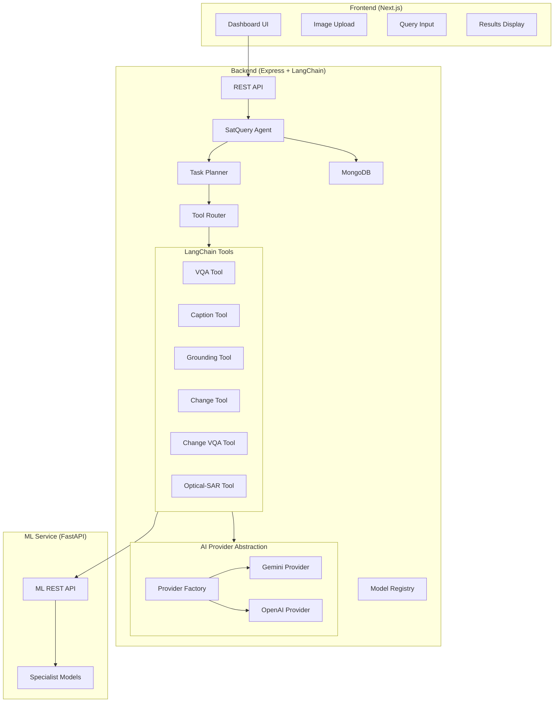

# SatQuery AI — Implementation Plan

## Overview

Build a production-quality MVP of **SatQuery AI**, an agentic vision-language assistant for remote-sensing imagery. The system is a monorepo with three services (Next.js frontend, Express/LangChain backend, FastAPI ML service) connected end-to-end, with AI providers configurable via `.env`.

---

## User Review Required

> [!IMPORTANT]
> **AI Provider**: The plan implements **Gemini** as the default provider (using `@langchain/google-genai`). Gemini's multimodal capabilities make it ideal for vision+language tasks. OpenAI is scaffolded as a second provider. Please confirm you have a Gemini API key ready, or let me know which provider to prioritize.

> [!IMPORTANT]
> **MongoDB**: The plan assumes MongoDB is available locally at `mongodb://localhost:27017`. If you'd prefer an in-memory fallback or MongoDB Atlas, let me know.

> [!IMPORTANT]
> **shadcn/ui**: The prompt requests Tailwind + shadcn/ui. Since the general guidance says to avoid Tailwind unless requested, I'll use it here as you've **explicitly requested** Tailwind CSS + shadcn/ui. I'll use Tailwind v3 with shadcn/ui.

---

## Open Questions

> [!NOTE]
> **Authentication**: The spec doesn't mention user auth. I'll skip auth for the MVP and treat all analyses as anonymous. Agree?

> [!NOTE]
> **PDF Reports**: I'll use `jspdf` for basic PDF report generation on the backend. Is that acceptable, or do you want a more sophisticated solution?

---

## Proposed Changes

The implementation is divided into **6 phases**, executed sequentially to maintain a working system at each stage.

---

### Phase 1: Monorepo Scaffold & Backend Foundation

Set up the entire folder structure, TypeScript configs, and core backend with health check.

#### [NEW] Root files
- `README.md` — Full project documentation
- `docker-compose.yml` — Multi-service Docker setup
- `.gitignore` — Comprehensive ignores
- `package.json` — Root workspace scripts

#### [NEW] `backend/` — Express/TypeScript server

| File | Purpose |
|------|---------|
| `package.json`, `tsconfig.json` | Project config |
| `src/server.ts` | Express app entry point |
| `src/config/env.ts` | Zod-validated env config |
| `src/config/database.ts` | MongoDB/Mongoose connection |
| `src/types/index.ts` | All shared TypeScript types & Zod schemas |
| `src/utils/response.utils.ts` | Consistent API response helpers |
| `src/utils/file.utils.ts` | File handling, metadata extraction |
| `src/middleware/error.middleware.ts` | Global error handler |
| `src/middleware/upload.middleware.ts` | Multer config with validation |
| `src/middleware/validation.middleware.ts` | Zod request validation |
| `src/routes/health.routes.ts` | Health check endpoint |

---

### Phase 2: Upload, Database & AI Provider Abstraction

#### [NEW] Upload System
| File | Purpose |
|------|---------|
| `src/routes/upload.routes.ts` | Upload endpoints |
| `src/controllers/upload.controller.ts` | Upload logic |
| `src/services/upload.service.ts` | File processing, metadata extraction |

#### [NEW] Database Models
| File | Purpose |
|------|---------|
| `src/models/analysis.model.ts` | Mongoose Analysis schema |

#### [NEW] AI Provider Abstraction
| File | Purpose |
|------|---------|
| `src/models/model.interface.ts` | `AIProvider` interface, `RemoteSensingModel` interface |
| `src/models/llm.provider.ts` | Provider factory — reads `AI_PROVIDER` from env |
| `src/models/vision.provider.ts` | Vision model abstraction |
| `src/models/model.registry.ts` | Model registry — maps tasks to models |
| `src/models/providers/gemini.provider.ts` | Gemini implementation |
| `src/models/providers/openai.provider.ts` | OpenAI scaffold |

**Key design**: `AIProviderFactory.create(env.AI_PROVIDER)` returns the configured provider. All downstream code uses the interface, never a concrete provider.

---

### Phase 3: LangChain Agent & Tools

The core agentic system using LangChain tool abstractions.

#### [NEW] Agent System
| File | Purpose |
|------|---------|
| `src/agents/state.ts` | Agent state type definitions |
| `src/agents/planner.ts` | Task classification & planning |
| `src/agents/router.ts` | Tool/model routing logic |
| `src/agents/satquery.agent.ts` | Main LangChain agent orchestrator |

#### [NEW] LangChain Tools
| File | Purpose |
|------|---------|
| `src/tools/vqa.tool.ts` | Visual Question Answering tool |
| `src/tools/caption.tool.ts` | Image captioning tool |
| `src/tools/grounding.tool.ts` | Region grounding tool |
| `src/tools/change.tool.ts` | Bi-temporal change analysis tool |
| `src/tools/changeVqa.tool.ts` | Change-based VQA tool |
| `src/tools/opticalSar.tool.ts` | Optical+SAR fusion tool |

Each tool implements `DynamicStructuredTool` from LangChain with Zod schemas for inputs/outputs.

#### [NEW] Analysis Pipeline
| File | Purpose |
|------|---------|
| `src/routes/analysis.routes.ts` | Analysis endpoints |
| `src/routes/model.routes.ts` | Model registry endpoints |
| `src/controllers/analysis.controller.ts` | Analysis request handling |
| `src/services/analysis.service.ts` | Orchestrates the full pipeline |
| `src/services/execution.service.ts` | Execution tracking & timing |
| `src/services/report.service.ts` | PDF report generation |

---

### Phase 4: Python ML Service

#### [NEW] `ml-service/` — FastAPI placeholder service

| File | Purpose |
|------|---------|
| `app/main.py` | FastAPI app with CORS |
| `app/routes/vqa.py` | VQA endpoint |
| `app/routes/caption.py` | Caption endpoint |
| `app/routes/grounding.py` | Grounding endpoint |
| `app/routes/change.py` | Change detection endpoint |
| `app/routes/optical_sar.py` | Optical-SAR fusion endpoint |
| `app/models/registry.py` | Model registry |
| `app/models/vqa_model.py` | VQA model adapter |
| `app/models/caption_model.py` | Caption model adapter |
| `app/models/change_model.py` | Change model adapter |
| `app/models/fusion_model.py` | Fusion model adapter |
| `app/utils/image_utils.py` | Image processing utilities |
| `requirements.txt` | Python dependencies |
| `README.md` | ML service documentation |

#### [NEW] BigEarthNet Training Placeholder
| File | Purpose |
|------|---------|
| `ml-service/training/bigearthnet/dataset.py` | Dataset loader scaffold |
| `ml-service/training/bigearthnet/train.py` | Training script scaffold |
| `ml-service/training/bigearthnet/config.yaml` | Training config |
| `ml-service/training/bigearthnet/README.md` | Training documentation |

---

### Phase 5: Frontend

#### [NEW] `frontend/` — Next.js 14 + Tailwind + shadcn/ui

**Pages:**

| Route | Component | Purpose |
|-------|-----------|---------|
| `/` | `page.tsx` | Landing page with hero, features, demo CTA |
| `/dashboard` | `page.tsx` | Main analysis workspace (3-panel layout) |
| `/history` | `page.tsx` | Previous analyses list |
| `/models` | `page.tsx` | Available models & capabilities |
| `/about` | `page.tsx` | Project info, architecture, team |

**Key Components:**

| Component | Purpose |
|-----------|---------|
| `ImageUploader` | Drag-drop upload with mode selection (single/bi-temporal/optical-SAR) |
| `ImageViewer` | Zoomable image viewer with before/after comparison |
| `QueryPanel` | Query input with example chips |
| `ResultPanel` | Answer, confidence, evidence display |
| `ExecutionTrace` | Expandable execution step timeline |
| `AnalysisCard` | History list item |
| `ModelCard` | Model capability display |
| `DemoMode` | Pre-loaded demo scenarios |
| `ReportDownload` | PDF download button |

**Design Language:**
- Dark theme with satellite/earth-observation visual identity
- Color palette: Deep navy (`#0a0e1a`), electric blue accents (`#3b82f6`), emerald indicators (`#10b981`)
- Glassmorphism panels, subtle grid backgrounds
- Professional SaaS dashboard aesthetic
- Smooth transitions, no excessive animation

---

### Phase 6: Integration, Demo Data & Polish

#### [NEW] `sample-data/`
- 4 demo scenarios with real remote-sensing imagery (sourced from open datasets or generated)
- Pre-configured demo queries

#### [NEW] `docs/`
- Architecture diagrams
- API documentation
- Model integration guide

#### Docker & Config
- `docker-compose.yml` — All 4 services
- `.env.example` files for each service

---

## Architecture Diagram



---

## Verification Plan

### Automated Tests
```bash
# Backend health check
curl http://localhost:5000/api/health

# Upload test
curl -X POST http://localhost:5000/api/upload -F "images=@test.jpg"

# Analysis test  
curl -X POST http://localhost:5000/api/analyze -H "Content-Type: application/json" -d '{"query":"Describe this image","inputType":"SINGLE_IMAGE","imageIds":["..."]}'

# ML service health
curl http://localhost:8000/health

# Frontend dev server
npm run dev --prefix frontend
```

### Manual Verification (5 Acceptance Tests)
1. **Single image VQA** — Upload → Query → Get task detection + answer + confidence + trace
2. **Single image captioning** — Upload → "Describe" → Captioning workflow
3. **Bi-temporal change** — Upload 2 images → Change query → Before/after + change answer
4. **Optical+SAR** — Upload optical+SAR → Cross-modal query → Combined analysis
5. **Provider swap** — Change `AI_PROVIDER` in `.env` → Restart → Same flow works

---

## Estimated Implementation Order & Time

| Phase | Estimated Effort | Cumulative |
|-------|-----------------|------------|
| 1. Monorepo + Backend foundation | ~45 min | 45 min |
| 2. Upload, DB, AI abstraction | ~45 min | 1.5 hr |
| 3. LangChain Agent + Tools | ~60 min | 2.5 hr |
| 4. Python ML Service | ~30 min | 3 hr |
| 5. Frontend (all pages) | ~90 min | 4.5 hr |
| 6. Integration, demo, polish | ~45 min | 5.25 hr |

This is aggressive but achievable. Each phase produces a working system.
